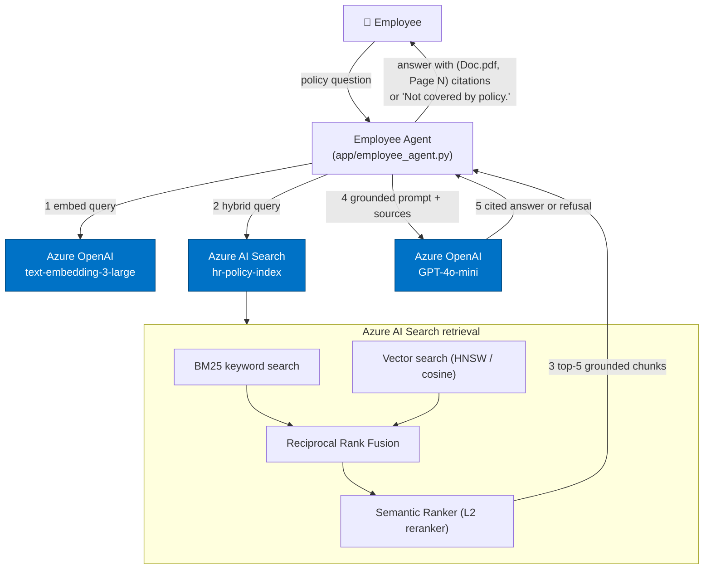

# Grounded Policy Q&A with Hybrid Retrieval

A production-grade, **compliance-safe** HR policy assistant. It answers employee policy
questions using **only** approved HR documents, attaches an inline citation
`(Document Name.pdf, Page N)` to **every factual sentence**, and refuses with exactly
`Not covered by policy.` whenever the documents do not support an answer. It never
hallucinates.

Built on **Azure AI Search** (BM25 + vector + semantic ranking) and **Azure OpenAI
GPT-4o-mini**.

---

## Why this exists

HR receives ~80 repetitive policy questions per day. This assistant deflects them while
meeting strict compliance rules:

- ✅ Every answer is **grounded** in approved policy documents.
- ✅ Every factual statement carries a **citation** (document name + page number).
- ✅ Out-of-scope questions are **refused**, never guessed.
- ✅ The model is constrained so it **cannot hallucinate** facts or fabricate citations.

---

## Architecture



Full diagram + design rationale: [architecture.md](architecture.md).

---

## Project structure

```
Assignment3/
└── project/
    ├── config.py                 # env-driven settings (no hardcoded secrets)
    ├── clients.py                # Azure OpenAI + AI Search client factories + embeddings
    ├── setup_all.py              # one-shot: PDFs → index → upload → eval
    ├── requirements.txt
    ├── .env.example              # copy to .env and fill in
    ├── data/
    │   ├── policy_corpus.py      # single source of truth for policy text (15 pages)
    │   ├── generate_pdfs.py      # PDF generation code
    │   ├── Employee_Handbook.pdf            (generated)
    │   ├── Benefits_and_Leave_Policy.pdf    (generated)
    │   └── Information_Security_SOP.pdf      (generated)
    ├── ingestion/
    │   ├── chunking.py           # token-aware chunking (500–700 tok, 100 overlap)
    │   ├── create_index.py       # Azure AI Search index creation
    │   ├── generate_embeddings.py# embedding pipeline
    │   └── upload_documents.py   # idempotent upsert to the index
    ├── search/
    │   └── hybrid_search.py      # hybrid + semantic ranking, + vector-only baseline
    ├── app/
    │   └── employee_agent.py     # grounded prompt, citations, refusal logic
    ├── evaluation/
    │   ├── eval_dataset.json     # 20-question gold dataset
    │   ├── run_eval.py           # citation correctness %
    │   └── adversarial_eval.py   # Hybrid vs Vector-only proof (12 queries)
    ├── README.md
    ├── architecture.md
    ├── index_design.md
    ├── evaluation_report.md
    └── deployment_guide.md
```

---

## Quick start

```bash
cd Assignment3/project

# 1. Install dependencies (use a virtual environment)
python -m venv .venv
. .venv/Scripts/activate          # Windows PowerShell: .venv\Scripts\Activate.ps1
pip install -r requirements.txt

# 2. Configure credentials — NEVER hardcode secrets
cp .env.example .env
#   edit .env with your Azure OpenAI + Azure AI Search keys/endpoints

# 3. Run the whole pipeline (PDFs → index → embed/upload → evaluations)
python setup_all.py

# 4. Ask the agent a question
python app/employee_agent.py "How many sick days require a medical certificate?"
```

Run steps individually:

```bash
python data/generate_pdfs.py          # generate the 3 dummy PDFs (offline)
python ingestion/create_index.py      # create/update the search index
python ingestion/upload_documents.py  # embed + upload chunks
python search/hybrid_search.py "remote work rules"   # ad-hoc retrieval test
python evaluation/run_eval.py         # citation correctness %
python evaluation/adversarial_eval.py # Hybrid > Vector proof
```

---

## Authentication (environment variables only)

All secrets come from environment variables / `.env`. Nothing is hardcoded.

| Variable | Purpose |
|---|---|
| `AZURE_OPENAI_ENDPOINT` | `https://oaiagenticaitraining-track2.openai.azure.com/` |
| `AZURE_OPENAI_API_KEY` | Azure OpenAI key |
| `AZURE_OPENAI_API_VERSION` | `2024-12-01-preview` |
| `AZURE_OPENAI_CHAT_DEPLOYMENT` | `gpt-4o-mini` |
| `AZURE_OPENAI_EMBEDDING_DEPLOYMENT` | `text-embedding-3-large` |
| `AZURE_SEARCH_ENDPOINT` | `https://<service>.search.windows.net` |
| `AZURE_SEARCH_API_KEY` | Search admin key |
| `AZURE_SEARCH_INDEX_NAME` | `hr-policy-index` |
| `AZURE_SEARCH_SEMANTIC_CONFIG` | `hr-policy-semantic` |

---

## Chunking strategy (and why)

- **Chunk size: 500–700 tokens (target 600).** Small enough that a retrieved chunk is
  specific to one policy rule (high precision), large enough to contain the complete
  rule with its conditions (no truncated meaning).
- **Overlap: 100 tokens.** A rule that straddles a boundary stays intact in at least one
  chunk, improving recall in hybrid search.
- **Never cross page boundaries.** Each chunk belongs to exactly one `(document, page,
  section)`, so the page number in every citation is always accurate — a hard compliance
  requirement.
- **Metadata preserved on every chunk:** `document_name`, `page_number`, `policy_section`,
  `last_updated`, plus a deterministic `id`/`chunk_id`.

Tokenization uses `tiktoken cl100k_base`, the encoding used by GPT-4o-mini and the
embedding models, so token budgets match the models exactly. Details:
[index_design.md](index_design.md).

---

## Retrieval pipeline

1. **Embed** the query (`text-embedding-3-large`, 3072 dims).
2. **Hybrid search** — BM25 keyword arm + vector arm, fused with Reciprocal Rank Fusion.
3. **Semantic ranking** — Azure AI Search L2 reranker reorders by deep relevance.
4. **Top-5 chunks** returned with citation metadata.
5. **Grounded prompt** built — chunks injected as labeled `SOURCES`.
6. **Answer** generated by GPT-4o-mini at `temperature=0`, or refusal.

---

## Compliance guardrails

- **Citation enforcement:** the agent parses citations from the model output and verifies
  each cited `(document, page)` actually exists in the retrieved chunks. If any citation
  is missing or fabricated, the agent **fails closed** and returns `Not covered by policy.`
- **Refusal:** if retrieval returns nothing, or the model is not confident, the agent
  returns exactly `Not covered by policy.` — no guessing, no general knowledge.
- **Determinism:** `temperature=0` minimizes variability and hallucination.

---

## Evaluation

| Artifact | What it proves |
|---|---|
| `evaluation/eval_dataset.json` | 20-question gold dataset (19 answerable + 1 refusal) |
| `evaluation/run_eval.py` | **Citation Correctness %** ≥ 90% target |
| `evaluation/adversarial_eval.py` | **Hybrid > Vector-only** across 12 adversarial queries |
| `evaluation_report.md` | Pre-computed expected results + tables |

**Citation Correctness % = Correct Citations / Total Citations** (target ≥ 90%).

---

## Refresh cadence

- **Daily ingestion** at 02:00 local via scheduled job (cron / Azure Function timer).
- **Incremental indexing:** deterministic chunk `id`s mean re-ingestion is an idempotent
  upsert; only changed pages produce changed content.
- **Re-embedding on change:** when a policy page changes, `last_updated` advances and its
  chunks are re-embedded and merged.
- **Versioning:** `last_updated` (DateTimeOffset) is stored per chunk and filterable, so
  you can audit, roll back, or scope retrieval to a known-good version.

See [deployment_guide.md](deployment_guide.md) for the full operational runbook.

---

## Acceptance criteria

| Criterion | Where |
|---|---|
| ✅ Hybrid Retrieval | `search/hybrid_search.py` (`hybrid_search`) |
| ✅ Semantic Ranking | `create_index.py` semantic config + `QueryType.SEMANTIC` |
| ✅ Every factual sentence cited | `app/employee_agent.py` system prompt + validator |
| ✅ "Not covered by policy." refusal | `app/employee_agent.py` (fail-closed) |
| ✅ Adversarial Hybrid > Vector | `evaluation/adversarial_eval.py` |
| ✅ Citation correctness ≥ 90% | `evaluation/run_eval.py` |
| ✅ Index schema documented | `index_design.md` |
| ✅ Chunking strategy documented | `index_design.md`, README |
| ✅ Refresh cadence documented | README, `deployment_guide.md` |
