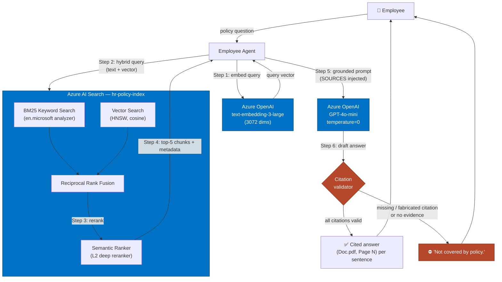
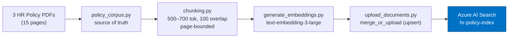

# Architecture

## System overview

## Ingestion pipeline

## Components

| Component | Responsibility | Azure service |
|---|---|---|
| Employee Agent (`app/employee_agent.py`) | Orchestration, grounded prompting, citation validation, refusal | — |
| Hybrid Search (`search/hybrid_search.py`) | BM25 + vector + semantic ranking; vector-only baseline | Azure AI Search |
| Embeddings (`clients.py`, `ingestion/generate_embeddings.py`) | Query + document vectorization | Azure OpenAI (`text-embedding-3-large`) |
| Answer generation | Grounded answer or refusal | Azure OpenAI (`gpt-4o-mini`) |
| Index (`ingestion/create_index.py`) | Schema, HNSW vector config, semantic config | Azure AI Search |
| Ingestion (`ingestion/*`) | PDF text → chunks → embeddings → upsert | Azure OpenAI + AI Search |

## Request lifecycle

1. **Embed query** — `text-embedding-3-large` produces a 3072-dim vector.
2. **Hybrid retrieval** — the keyword (BM25) and vector arms run together; Azure fuses
   them with Reciprocal Rank Fusion (RRF).
3. **Semantic ranking** — the L2 reranker reorders the fused candidates by deep semantic
   relevance to the query, using the `policy_section` title + `chunk_text` content fields.
4. **Top-5** chunks (with `document_name`, `page_number`, `policy_section`) returned.
5. **Grounded prompt** — chunks injected as numbered `SOURCES`; the system prompt forbids
   outside knowledge and mandates per-sentence citations.
6. **Generation + guardrail** — GPT-4o-mini answers at `temperature=0`. The agent then
   validates that every cited `(document, page)` exists in the retrieved chunks. Any
   violation → fail closed → `Not covered by policy.`

## Design principles

- **Grounding over fluency** — the model may only use injected sources.
- **Fail closed** — ambiguity or unverifiable citations resolve to refusal, never a guess.
- **Page-accurate citations** — chunks never cross page boundaries, so a citation always
  resolves to a real page in a real PDF.
- **Determinism** — `temperature=0` for reproducibility and lower hallucination risk.
- **Idempotent ingestion** — deterministic chunk IDs make re-ingestion a safe upsert.
